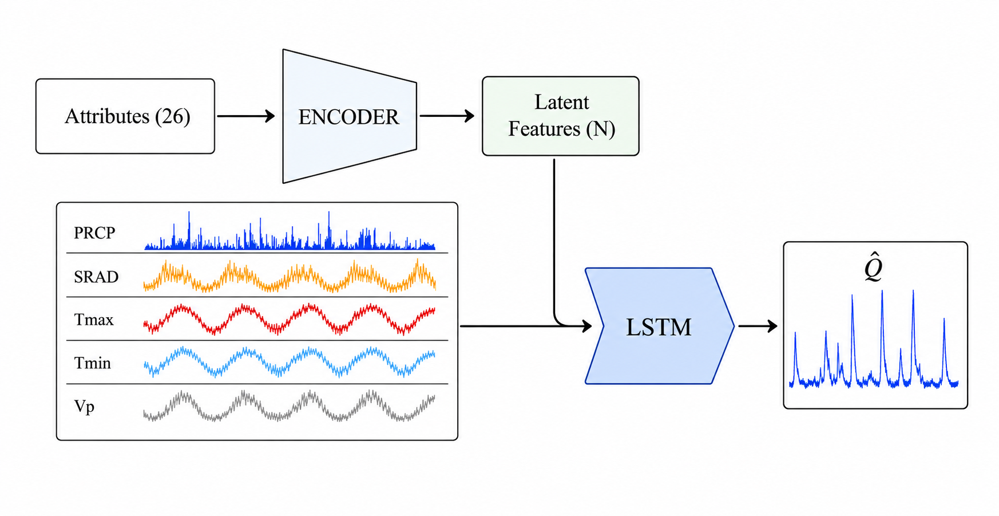

# How Much Catchment Information Does an LSTM Use for Streamflow Prediction?

Code and intermediate results for the manuscript by Alberto Bassi, Fabrizio Fenicia, Antonietta Mira and Carlo Albert (submitted to *Water Resources Research*).

## Main idea

Entity-aware LSTMs use static catchment attributes together with meteorological forcings to predict streamflow, in gauged and in ungauged basins. We ask how much of the information in the 26 commonly used CAMELS-US attributes the LSTM actually needs once it already sees the weather.

<p align="center"></p>

The 26 attributes pass through an MLP encoder that compresses them into **N latent features**. The LSTM sees only these features plus 15 forcing time series: precipitation, solar radiation, Tmax, Tmin and vapour pressure from Daymet, Maurer and extended NLDAS. Because the encoder is trained together with the forcing-driven LSTM, it is pushed to keep the attribute information that complements the weather. Varying N shows how many dimensions that information really occupies.

Model names used in the paper and in the code:

| Name | Meaning | `--encoded_space_dim` |
|---|---|---|
| `GLOBAL-N` | Trained on all 531 basins, evaluated on a later period | `N` |
| `PUB-N` | Prediction in ungauged basins, 12-fold cross-validation over basins | `N` |
| `*-0` | No attribute information | `0` |
| `*-A` | Reference model: all 26 attributes fed directly to the LSTM, no encoder | `None` |

**Main findings:** about two latent features retain most of the predictive information of the 26 attributes. The first feature gives most of the gain, in both GLOBAL and PUB. The latent space is dominated by topography, with regional contributions from vegetation and soil.

## Repository layout

```
main.py              training, evaluation and gradients (modes: train, evaluate, gradients, save_create_splits)
src/                 model (MLP encoder + LSTM), CAMELS data loading, metrics, signatures, plotting helpers
scripts/             post-processing (merge, metrics, bootstrap, latent features, gradients) and plot_* scripts
data/                basin list (531 basins), attribute database, PUB fold files (seeds 300-303), US state outlines
analysis/            intermediate results used for the figures: stats/, encoded_features/, gradients/,
                     bootstrap/, signatures/, figures/
train_*.sh, run_*.sh SLURM job scripts for training and post-processing
```

Trained checkpoints, the ensemble streamflow predictions (`analysis/results_data/`) and the 5,000-replicate bootstrap files are not included because of their size. Everything needed to regenerate the figures from the intermediate results is in `analysis/`.

## Installation

Two conda environments are provided. DADApy, used only for the intrinsic-dimension analysis in Fig. 2, needs `numpy<2` and cannot share the main environment.

```sh
conda env create -f environment.yml          # main: training, analysis, all figures except Fig. 2
conda env create -f environment-gride.yml    # Fig. 2 only
conda activate ea-encoder-lstm
```

If you have packages in your user site-packages (`~/.local/lib/python3.*`), set `export PYTHONNOUSERSITE=1` before creating and using the environments. Otherwise pip may skip pinned packages, and Python may load the wrong versions.

Most plotting scripts render text with LaTeX (`text.usetex`), so a TeX installation with `amsmath` and `amsfonts` must be on `PATH`. Fig. 6 downloads basemap tiles and needs internet access.

Run all Python scripts from the repository root as modules, for example `python -m scripts.plot_ensemble`.

## Reproducing the training results

**Data.** Download [CAMELS-US](https://ral.ucar.edu/solutions/products/camels) and the [extended NLDAS and Maurer forcings](https://doi.org/10.4211/hs.0a68bfd7ddf642a8be9041d60f40868c). The code expects this layout, by default at `../Datasets/CAMELS-US/`; pass `--camels_root` to change it:

```
CAMELS-US/
├── basin_mean_forcing/{daymet,maurer_extended,nldas_extended}/
└── usgs_streamflow/
```

Static attributes are already in `data/attributes.db`. The PUB fold files are in `data/kfold_splits_seed{300..303}.p` and can be recreated with `python main.py save_create_splits --n_splits 12 --seed 300`.

**Periods.** Training covers 1999-10-01 to 2008-09-30, validation 1981-10-01 to 1989-09-30, and test 1989-10-01 to 1999-09-30. Hyper-parameters are in `GLOBAL_SETTINGS` in `main.py`. The encoder has 4 layers of 300 units. The linear encoder of Appendix C uses `'hidd_layers': []`.

**Logging.** Each training job writes its stdout to `reports/`, and the post-processing scripts read the `run_dir:` line from these logs, so create the folder first with `mkdir -p reports`. The job scripts locate run directories by splitting the logged path on `Attention4Hydro/`, so clone the repository into a folder with that name.

**Pipeline.** Run bash script with `bash`. Each model is an ensemble of four random restarts (runs 0-3). `N` is the latent dimension, or `None` for the `-A` models.

```sh
# 1. Train: GLOBAL (4 runs) and PUB (4 runs x 12 folds; run r uses data/kfold_splits_seed{300+r}.p)
bash train_global.sh N 0 4                      # args: N init_run nruns
bash train_pub.sh    N 0 4 12 0                 # args: N init_run nruns nsplits init_split

# 2. Evaluate every run and merge the ensemble into analysis/results_data/{global,pub}_esN_test.pkl
bash run_analysis_global.sh ae N test 4 0       # args: tag N period nruns init_run
bash run_analysis_pub.sh    ae N test 4 0 12 0  # args: tag N period nruns init_run nsplits init_split

# 3. Metrics and signatures -> analysis/stats/test/global_esN.csv
python -m scripts.main_performance global N test

# 4. Leave-one-run-out envelopes (Fig. 3) and paired block bootstrap (Table 1, Figs. D1-D4)
python -m scripts.compute_leave_one_out global N test nse
python -m scripts.compute_block_bootstrap global N test --block-method sliding
python -m scripts.compare_bootstrap --eval-period test --block-method sliding --alpha 0.05 \
    --extra-global-features 4 --output-dir analysis/bootstrap/comparisons_alpha0.05

# 5. Latent features and encoder gradients (Figs. 6-9, Table 2)
python -m scripts.compute_encoded_features --experiment global --encoded_features 2
python -m scripts.compute_encoder_gradients --experiment global --encoded_features 2
```

Replace `global` with `pub` for the PUB models. Step 4 writes the comparison table to `analysis/bootstrap/comparisons_alpha0.05/comparison_table.tex`.

## Reproducing the figures

All commands run from the repository root, using the intermediate results in `analysis/`. Figures are written to `analysis/figures/`, except Figs. D1-D4, which go to `analysis/bootstrap/comparisons_alpha0.05/maps/`.

| Figure | Command |
|---|---|
| 1 | Schematic (`analysis/figures/model.png`) |
| 2 | `python -m scripts.analyse_id_attributes` (in `ea-encoder-lstm-gride`) |
| 3 | `python -m scripts.plot_bootstrap --leave_one_out` |
| 4 | `python -m scripts.plot_metric_boxplots --metrics kge bias r_coeff stdev_rat` |
| 5 | `python -m scripts.plot_delta_nse_distributions` |
| Table 1 | `analysis/bootstrap/comparisons_alpha0.05/comparison_table.tex` (pipeline step 4) |
| 6 | `python -m scripts.plot_encoded_features --model both --encoded_features 2 --with_ica True` |
| 7 | `python -m scripts.plot_encoded_attribute_signature_spearman --encoded_features 2 --with_ica True` |
| 8, Table 2 | `python -m scripts.plot_encoder_gradients_mult --with_ica True` (Table 2 is printed as LaTeX) |
| 9 | `python -m scripts.plot_encoded_space_2d --model global --targets soil_conductivity sand_frac elev_mean area_gages2 low_q_freq baseflow_index gvf_max frac_forest p_mean` |
| A1 | `python -m scripts.plot_correlation_known_attrs` |
| C1 | `python -m scripts.plot_ensemble --eval_period val` |
| C2 | `python -m scripts.plot_validation_loss` |
| D1-D4 | `python -m scripts.plot_bootstrap_significance --comparison-dir analysis/bootstrap/comparisons_alpha0.05` |

The models shown in Figs. 3, 4, C1 and C2, and their colours, are set by `cmodels` in `src/plot_utils.py`.
<!-- 
## Citation

If you use this code, please cite:

```bibtex
@article{bassi_catchment_information_lstm,
  title   = {How Much Catchment Information Does an LSTM Use for Streamflow Prediction?},
  author  = {Bassi, Alberto and Fenicia, Fabrizio and Mira, Antonietta and Albert, Carlo},
  journal = {Water Resources Research},
  year    = {YYYY},
  volume  = {VV},
  pages   = {PPPP},
  doi     = {10.XXXX/XXXXX},
}
``` -->

## License

MIT, see [LICENSE](LICENSE).
